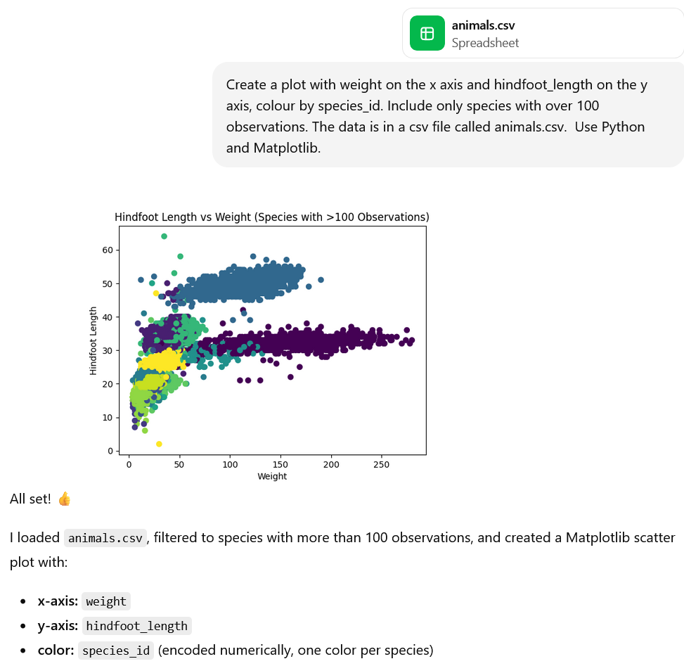

:::::::::::::::::::::::::::::::::::::: questions 

- How can AI be used effectively as a reference or learning aid rather than a substitute for problem-solving?
- What types of coding tasks benefit most from AI assistance?
- How should developers evaluate and validate AI-generated code, explanations, or fixes?

::::::::::::::::::::::::::::::::::::::::::::::::

::::::::::::::::::::::::::::::::::::: objectives

- Explain why delegating full software development to AI without understanding the solution introduces technical, ethical, and reliability risks.
- Describe appropriate roles for AI tools as assistants rather than autonomous developers.
- Use ChatGPT as a reference tool to locate, summarize, and clarify technical information more precisely than traditional search methods.
- Apply AI tools to explain unfamiliar code to support learning.
- Use AI-generated suggestions to debug code and resolve errors, while validating the proposed fixes.
- Generate boilerplate code and perform basic refactoring tasks using AI assistance.
- Use AI tools to draft technical documentation.
- Translate code between programming languages using AI assistance.
- Evaluate AI-generated code and explanations for correctness, efficiency, and alignment with project requirements.
- Analyze when AI assistance enhances productivity versus when it may obscure understanding or introduce errors.


::::::::::::::::::::::::::::::::::::::::::::::::

# Scenario

Sally, a PhD student in Biology has just received from a colleague some data on the animal species found within plots of land at a desert study site in Arizona.

The dataset is stored as a comma separated value (CSV) file. Sally opens the csv file in excel or a similar spreadsheet tool and has a look at the data. She sees the variable names in the top row of the spreadsheet.   Each row holds information for a single animal, and the columns represent:


| Column           | Description                        |
| ---------------- | ---------------------------------- |
| record\_id       | Unique id for the observation      |
| month            | month of observation               |
| day              | day of observation                 |
| year             | year of observation                |
| plot\_id         | ID of a particular plot            |
| species\_id      | 2-letter code                      |
| sex              | sex of animal (“M”, “F”)           |
| hindfoot\_length | length of the hindfoot in mm       |
| weight           | weight of the animal in grams      |
| genus            | genus of animal                    |
| species          | species of animal                  |
| taxon            | e.g. Rodent, Reptile, Bird, Rabbit |
| plot\_type       | type of plot                       |


::::::::::::::::::::::::::::::::::::: callout

## Where does the data come from?

The data we're working with comes from the [Portal Project](https://portal.weecology.org/), a long-term ecological study being conducted near Portal, Arizona. Since 1977, the site has been used to study interactions between rodents, ants and plants.

For this scenario, we use a CSV file that is a subset of the teaching-focused Portal dataset. This version has been simplified by removing some of the complexities of the full dataset, making it more suitable for computational training and learning exercises.

::::::::::::::::::::::::::::::::::::::::::::::::

The email reads:


*Hi Sally,*

*Here's the data on animal species on the Portal site in Arizona.*  

*Please can you make a plot of the data as quickly as possible so that we can present them at the seminar tomorrow?*

*I need a plot of hindfoot length vs weight to explore whether these two variables are correlated, including only species with over 100 observations.*  

*I make all my plots using Matplotlib in Python so it would be great if you could make this plot using that library so that I can edit and add to the plot later.*

*Thanks!*

*David*


Sally knows that Matplotlib is a plotting library in Python but she's not quite sure how to use it.  She gets the impression that David needs this plot quickly and doesn't think she has time to learn matplotlib fast enough, so she decides to ask AI to make the plot for her.

She opens an AI chat interface (such as ChatGPT, Microsoft Copilot or Claude) and prompts the AI to:

'Generate some code to create a plot with weight on the x axis and hindfoot_length on the y axis, colour by species_id. Include only species with over 100 observations. The data is in a csv file called animals.csv.  Use Python and Matplotlib.' 


Sally's AI-generated code:

```python
import pandas as pd
import matplotlib.pyplot as plt

# Load data
df = pd.read_csv("animals.csv")

# Drop rows with missing values in relevant columns
df = df.dropna(subset=["weight", "hindfoot_length", "species_id"])

# Keep only species with > 100 observations
species_counts = df["species_id"].value_counts()
valid_species = species_counts[species_counts > 100].index
df_filtered = df[df["species_id"].isin(valid_species)]

# Create plot
plt.figure(figsize=(10, 6))

for species in df_filtered["species_id"].unique():
    subset = df_filtered[df_filtered["species_id"] == species]
    plt.scatter(
        subset["weight"],
        subset["hindfoot_length"],
        s=10,
        alpha=0.5,
        label=str(species)
    )

plt.xlabel("Weight")
plt.ylabel("Hindfoot length")
plt.title("Weight vs Hindfoot Length by Species (n > 100)")
plt.legend(title="Species ID", bbox_to_anchor=(1.05, 1), loc="upper left")
plt.tight_layout()

plt.show()
```

She could then run this code and produce the plot.

She then realises she could go one step further and upload the dataset to the AI chat so that the analysis can actually be run within the AI tool (depending on the features that you have access to with your AI tool). **Note: we can only do this because this dataset is publicly available. Don't upload any private or sensitive data.**

{alt="Screenshot of uploaded csv, chatGPT prompt, and generated plot"}

::::::::::::::::::::::::::::::::::::: challenge 

What are the problems with getting an AI tool to write your research code for you? Consider:

- Technical risks
- Reliability risks
- Ethical and academic integrity risks

Which additional problems are introduced when you also use AI to run the code?

Write your thoughts in the shared document.

:::::::::::::::::::::::: solution 

Artificial intelligence tools can generate code quickly and often convincingly. For researchers who are new to programming, this can be appealing: it may seem efficient to delegate the entire task of software development to an AI system. However, doing so without understanding the solution introduces significant technical, ethical, and reliability risks.

- AI-generated code may appear correct but can contain subtle errors, which may only appear under certain conditions. 
- If the researcher doesn't understand the AI-generated code they can't verify that the implementation matches the intended analysis and therefore they can't comprehensively defend their findings. 
- The same prompt may produce different solutions at different times, causing problems for reproducibility of your research.
- Generated code may rely on undocumented assumptions.
- Dependencies, versions, or defaults in AI-generated code may change without warning. 
- The researcher rather than the AI system will be held accountable for any errors in AI-generated code. When you use AI-generated code you don't fully understand, you risk being held accountable for any errors in that code. 
- Using AI-generated code that you don't fully understand limits research transparency, as you cannot explain your methods to reviewers and collaborators.
- Using code you do not understand may amount to overstating your expertise or control over the research process, and this misrepresentation is an academic integrity risk. 


### Additional Problems with AI also Runs the Code

- When AI runs code for you, the execution environment (hardware, operating system, library versions) may be opaque, making results hard to interpret or reproduce.
- The AI can hide warnings, errors, or suspicious behavior, increasing the likelihood that flawed results go unnoticed.
- Uploading data or running code through AI systems can reduce your control over how data is handled, including where it is stored, whether it is logged or reused, and how long it is retained. Without clear guarantees, data may persist beyond its intended use, whether temporarily in memory, in logs, or in backups, creating risks for confidentiality, compliance, and ethical oversight.
- When AI both generates and executes code, researchers may be more likely to trust outputs uncritically, reducing independent verification and scrutiny.
:::::::::::::::::::::::::::::::::

::::::::::::::::::::::::::::::::::::::::::::::::

::::::::::::::::::::::::::::::::::::: callout

## Reduce the Risk of your Data being Reused

By default, generative AI platforms such as ChatGPT will often use your inputs to train the model and improve its performance.  

To turn this off, click on your username in the lower left corner -> Settings -> Data Controls -> Improve the model for everyone -> Switch off

::::::::::::::::::::::::::::::::::::::::::::::::


# Appropriate Roles for AI when Writing Research Code

AI tools can be highly valuable when used correctly, as a tool to assist you with your research. The key principle is that they should function as assistants, not autonomous developers.

Appropriate uses of AI include:

- Explaining unfamiliar concepts, terminology or programming frameworks.
- Helping you to spot bugs (problems) in your code and suggesting possible fixes.
- Writing boilerplate code (standard structures for functions, modules etc.)
- Supporting you to write technical documentation. 
- Helping to translate ideas into a starting implementation or prototype

In the rest of this episode, we'll walk through these ways that AI can assist you with coding.  We'll work with the animals data Sally plotted and we'll run the code using Jupyter notebooks.  

## Setting up: Data Download and Walkthrough of Jupyter Notebooks

First, download the data from here: [animals.csv](data/animals.csv).  

For this session, we'll run code chunks using Jupyter notebooks.

A Jupyter notebook is an interactive, web-based document that lets you run chunks of code, view their output, and mix in text and visualisations.

You should have already installed Anaconda Navigator which includes a Jupyter Notebooks installation. 

- Type 'Jupyter Notebook' into the search bar and click on the Jupyter Notebooks app to open it. (Alternatively, open Anaconda Navigator and open Jupyter Notebooks from there).  
- Let's first have a look at the engine running Jupyter Notebooks.  Click **New** --> **Terminal**

From the terminal you can check the version of python that your jupyter notebook will use:
```bash
python --version
```

You can also check which python packages are installed by default:
```bash
pip list
```
- Head back to the **Home** tab and create a new folder 'animals_data_analysis': **New** --> **New Folder** Select the new Untitled folder, click **Rename** and change the name to animals_data_analysis.
- Click on the animals_data_analysis folder to open it (it will currently be empty).
- Drag and drop animals.csv from your file explorer downloads into this folder.  Check the file is called 'animals.csv' exactly, rename the file if needed (e.g. if you've downloaded it more than once and it's called animals(1).csv).
- Create a new Jupyter notebook in this folder called 'animals_plots': **New** --> **Python 3 (ipykernel)** A new Jupyter notebook called 'Untitled' will open automatically, click on the name 'Untitled' to rename the file to 'animals_plots'.  The file should have the file extension .ipynb which indicates it's a file of type Jupyter notebook.

{alt="screenshot of an empty jupyter notebook"}

- A Jupyter notebook consists of a sequence of cells.  These can be **code**, **markdown** (a plain-text formatting syntax that allows you to add elements like headers, bold text, and lists without using complex HTML code) or **raw** (displays content exactly as typed). Check that the cell type dropdown is set to code and type the code below in the cell.

```python
print('Hello World')
```
- Press the triangle in the header menu to run the code in the cell
- A new cell will usually be created when you run the previous one. To add another cell manually click the plus sign in the header menu. To remove a cell, click the rubbish bin on the far right of the cell.
- Let's create a title for our Jupyter notebook using a markdown cell. Click on your new empty cell and select **Markdown** from the cell types dropdown. Type in the markdown cell: `# Animals Data Analysis`. (the `#` formats the text as a heading in markdown).
- We probably want our title at the top of the Jupyter notebook.  Click the up arrow in the cell containing `# Animals Data Analysis` to move it to the top of the document. With your cursor still in this cell click the run button to render the markdown text as a heading. 
- Move your cursor back to the cell containing `print('Hello World!')` and click the plus sign in the header bar to create a new cell underneath of type 'code'.  This is where we will start typing and running the animals code.


## Using AI to Understand Code and Technical Concepts 

AI tools like ChatGPT can serve as an interactive reference and tutor, helping you to understand unfamiliar coding constructs, libraries, or data analysis techniques. Unlike traditional search engines, AI can summarise and clarify technical information in context, tailored to your specific dataset, code, or research question.


- **Locate technical information quickly**: Instead of reading through multiple documentation pages, you can ask AI to find the relevant function, argument, or method for your task.
- **Summarise key concepts**: AI can condense long documentation into concise, understandable explanations. You can even ask AI to tailor explanations to you code and dataset. 
- **Clarify ambiguous points**: You can follow up iteratively, asking AI to rephrase explanations or provide examples.
- **Code comprehension**: Paste code generated by AI or colleagues and ask for line-by-line explanations.
- **Contextual learning**: Ask why certain functions or methods are used, what alternatives exist, and best practices.


::::::::::::::::::::::::::::::::::::: challenge 

## Up-skill rather than De-skill with AI

Rather than asking AI to actually generate the code for the weight vs hindfoot length plot, instead ask for a step-by-step explanation of how you would do it with your preferred technologies and packages. 

e.g. *“Explain how to filter a DataFrame in Python to include only species with more than 100 observations, and then plot hindfoot_length vs weight coloured by species using MatplotLib.”* 

Use this explanation to create the code for the plot and run it in the empty code cell of your jupyter notebook. 

Hint: To help you understand what the code does, ask AI to explain it to you line by line and ask follow up questions if anything is unclear. 

::::::::::::::::::::::::::::::::::::::::::::::::


## Debugging and Error Analysis

**Scenario**:
Sally has realised it's better long-term if she learns to code herself.  She's written the following Python code to plot weight vs hindfoot length by species using Matplotlib, but when she tries to run it, the code fails with an error. 

```python
import pandas as pd
import matplotlib.pyplot as plt

# Load the data
df = pd.read_csv("animals.csv")

# Count observations per species
species_counts = df["species_id"].value_counts()

# Keep only species with >100 observations
valid_species = species_counts[species_counts > 100].index
df_filtered = df[df["species_id"].isin(valid_species)]

# Create the plot
plt.figure(figsize=(10, 6))

for species, group in df_filtered.groupby("species_id"):
    plt.scatter(
        group["weight"],
        group["hindfoot_lenght"],
        label=species,
        alpha=0.7
    )

plt.xlabel("Weight")
plt.ylabel("Hindfoot Length")
plt.title("Hindfoot Length vs Weight (Species with >100 Observations)")
plt.legend(title="Species ID")
plt.tight_layout()
plt.show()

```

```output
KeyError: 'hindfoot_lenght'
```

Try running the code above to check you get the same error.

Rather than asking AI to “fix the code,” Sally decides to use it as a debugging assistant to help her understand the error properly. 

She enters the prompt “I am getting a KeyError: 'hindfoot_lenght' when running the following Python code that uses pandas and matplotlib. Can you help me understand what this error means and how to diagnose it?” 

This wording of the prompt will result in explanation rather than just a correction and substitution of the code and will help Sally learn how to diagnose similar problems in future rather than becoming reliant on AI. 

Try it out using your AI tool.

In this example, AI might explain that:

- A KeyError in pandas means a column name does not exist
- The issue is likely a mismatch between the dataset’s column names and those referenced in the code

At this point, Sally verifies this claim independently by inspecting the dataset's column names and checking for spelling inconsistencies.

::::::::::::::::::::::::::::::::::::: challenge 

## AI as a Debugging Assistant

The code below contains a different bug. Run the code, use AI to help you debug it, then apply the fix and verify that the code runs as expected. 

```python
import pandas as pd
import matplotlib.pyplot as plt

# Load the data
df = pd.read_csv("animal.csv")

# Count observations per species
species_counts = df["species_id"].value_counts()

# Keep only species with >100 observations
valid_species = species_counts[species_counts > 100].index
df_filtered = df[df["species_id"].isin(valid_species)]

# Create the plot
plt.figure(figsize=(10, 6))

for species, group in df_filtered.groupby("species_id"):
    plt.scatter(
        group["weight"],
        group["hindfoot_length"],
        label=species,
        alpha=0.7
    )

plt.xlabel("Weight")
plt.ylabel("Hindfoot Length")
plt.title("Hindfoot Length vs Weight (Species with >100 Observations)")
plt.legend(title="Species ID")
plt.tight_layout()
plt.show()

```
:::::::::::::::::::::::: solution 

```output
FileNotFoundError: [Errno 2] No such file or directory: 'animal.csv'
```

Prompt: I am getting the error: FileNotFoundError: [Errno 2] No such file or directory: 'animal.csv'. Can you help me understand what this error means and how to diagnose it?

The AI's output may include:
- This error is raised by Python when your code attempts to open a file that the operating system cannot locate at the specified path.
- The most common causes - the file is not in the current working directory, the filename is misspelled, the file path is incorrect, the file has not been created.

In this case the filename is misspelled as 'animal.csv' rather than 'animals.csv'.  


:::::::::::::::::::::::::::::::::
::::::::::::::::::::::::::::::::::::::::::::::::


## Code Generation


### Boilerplate

AI can be particularly useful for some coding tasks that are tedious or repetitive such as writing boilerplate code.

Boilerplate code is a term used to describe standard code structures that are repeated in multiple places with little variation. Examples of boilerplate code across a few different contexts include:

- Templates for function and class definitions
- Setup for plots in python or R
- Basic web page structure in HTML

Using AI to generate boilerplate code can save you time with minimal risk, allowing you to spend your time and effort focusing on the intent of the analysis rather than the programming language's syntax. 

For example let's try entering the prompt:
"Generate boilerplate code to load a csv file and create a histogram of one column"

```python
import pandas as pd
import matplotlib.pyplot as plt

# Load the CSV file
df = pd.read_csv("data.csv")

# Create a histogram for a single column
plt.figure(figsize=(8, 6))
plt.hist(df["column_name"], bins=30)
plt.xlabel("Column Values")
plt.ylabel("Frequency")
plt.title("Histogram of Column Name")
plt.tight_layout()
plt.show()
```


When you have the boilerplate code, you can edit it to give the desired outcome. 

::::::::::::::::::::::::::::::::::::: challenge 

## Edit AI-Generated Boilerplate Code

Edit the AI-generated boilerplate code above to produce a histogram of weight:

- Copy and paste the boilerplate into a new code cell of your Jupyter notebook
- Read through the generated boilerplate to make sure it's doing what you expect
- Change the csv file name to `animals.csv`
- Change the column_name to `weight`
- Run the code to produce the histogram

:::::::::::::::::::::::: solution 

```python
import pandas as pd
import matplotlib.pyplot as plt

# Load the CSV file
df = pd.read_csv("animals.csv")

# Create a histogram for a single column
plt.figure(figsize=(8, 6))
plt.hist(df["weight"], bins=30)
plt.xlabel("Column Values")
plt.ylabel("Frequency")
plt.title("Histogram of Column Name")
plt.tight_layout()
plt.show()
```
:::::::::::::::::::::::::::::::::
::::::::::::::::::::::::::::::::::::::::::::::::


### Documentation

Writing thorough code documentation can be time-consuming.  This is a major reason why many scripts are left undocumented and are difficult to understand later, either by others or by yourself. AI can help by generating documentation automatically, making it faster to produce clear, understandable explanations of your code.

For example, if we extract plotting code into a function like `plot_species_scatter`, we can use AI to generate a docstring for the function. A **docstring** in Python is a short note written at the start of a function that explains what it does, what inputs the function takes, and what the function outputs.

Note that there are a few different styles of docstring for python: Google style , Sphinx style , NumPy style, and Epytext style. If the code you're working with follows a particular style, you can specify the style of docstring in your prompt.


```python
def plot_species_scatter(df, species_col="species_id", x_col="weight", y_col="hindfoot_length", min_count=100):
    df_filtered = filter_species_by_count(df, species_col, min_count)
    
    plt.figure(figsize=(10, 6))
    
    for species, group in df_filtered.groupby(species_col):
        plt.scatter(
            group[x_col],
            group[y_col],
            label=species,
            alpha=0.7
        )
    
    plt.xlabel(x_col.capitalize())
    plt.ylabel(y_col.replace("_", " ").capitalize())
    plt.title(f"{y_col.replace('_', ' ').capitalize()} vs {x_col.capitalize()} (Species with >{min_count} Observations)")
    plt.legend(title=species_col)
    plt.tight_layout()
    plt.show()
```


::::::::::::::::::::::::::::::::::::: challenge 

## Generate a Docstring

Copy and paste `plot_species_scatter` function from above into your AI tool and ask the AI to generate a docstring for the function.

If you know Python, verify that the docstring accurately represents what the code does.  More specifically, check that the listed parameters match the function’s arguments and confirm that any descriptions of functionality align with the actual code logic.  

If you don't know Python, read through the docstring and use it to help you understand what the function does. 

:::::::::::::::::::::::: solution 

Prompt: Generate a docstring for the following function: 

```python
def plot_species_scatter(df, species_col="species_id", x_col="weight", y_col="hindfoot_length", min_count=100):
    df_filtered = filter_species_by_count(df, species_col, min_count)
    
    plt.figure(figsize=(10, 6))
    
    for species, group in df_filtered.groupby(species_col):
        plt.scatter(
            group[x_col],
            group[y_col],
            label=species,
            alpha=0.7
        )
    
    plt.xlabel(x_col.capitalize())
    plt.ylabel(y_col.replace("_", " ").capitalize())
    plt.title(f"{y_col.replace('_', ' ').capitalize()} vs {x_col.capitalize()} (Species with >{min_count} Observations)")
    plt.legend(title=species_col)
    plt.tight_layout()
    plt.show()
```

Example AI - generated docstring:

```python
    """
    Creates a scatter plot of two numerical variables for species with a minimum number of observations.
    
    The function filters the input DataFrame to include only species that have more than `min_count`
    observations, then plots `x_col` vs `y_col` for each species as separate scatter points with a legend.

    Parameters:
        df (pd.DataFrame): The input DataFrame containing the data.
        species_col (str, optional): Column name representing species IDs. Defaults to "species_id".
        x_col (str, optional): Column name for the x-axis values. Defaults to "weight".
        y_col (str, optional): Column name for the y-axis values. Defaults to "hindfoot_length".
        min_count (int, optional): Minimum number of observations required for a species to be included. Defaults to 100.

    Returns:
        None. Displays a matplotlib scatter plot.
    
    Example:
        >>> plot_species_scatter(df, species_col="species_id", x_col="weight", y_col="hindfoot_length", min_count=50)
    """
```


:::::::::::::::::::::::::::::::::
::::::::::::::::::::::::::::::::::::::::::::::::


::::::::::::::::::::::::::::::::::::: callout

## Which other coding tasks can benefit from AI assistance?

- Improving or optimising your code e.g. "Can you refactor this code to move the species-filtering logic into a small function, without changing its behaviour?"
- Generating first drafts or rapid prototypes
- Translating code between programming languages (Make sure you understand the translation so that you can troubleshoot, extend, or adapt it safely for future analyses!)

::::::::::::::::::::::::::::::::::::::::::::::::


::::::::::::::::::::::::::::::::::::: challenge 

## Discussion: Which coding tasks could AI help you with?

When you next have to write some code for data analysis or software development, which tasks would you use AI tools to assist with? 

::::::::::::::::::::::::::::::::::::::::::::::::

## Integrating AI Tools into IDEs

In this episode, we have used separate interfaces to interact with AI and to run our code.  As of 2025 this was the most common way that researchers interacted with AI for coding assistance.  However, it is also possible to integrate AI into an environment you use to write and run code (known as an Integrated Development Environment or IDE).  For example, an AI assistant called GitHub Copilot can be integrated IDEs such as Visual Studio Code.  There are some advantages and disadvantages to this integrated approach: 

### Advantages of using an IDE-Integrated AI Assistant

- **Context awareness**: Integrated AI can access the files and project structure in your IDE, making suggestions that are relevant to your current codebase.
- **Immediate feedback and autocompletion**: As well as the AI chat tool that we've been using in this session, IDE-integrated AI also offers autocompletion and code suggestions as you're typing. 
- **Seamless workflow**: You don't have to switch between windows or copy-paste code. Everything happens in one environment, which can reduce cognitive load.

### Disadvantages of using an IDE-Integrated AI Assistant

- **Limited explanation**: Unlike a standalone AI like ChatGPT, IDE-integrated AI often provides suggestions without detailed reasoning. This can reduce researchers' understanding of AI-generated code
- **Potential over-reliance**: It can be very tempting to accept AI code suggestions that appear to work, without fully understanding them, and this can lead to errors or misunderstandings about what your code does.
- **Privacy and security risks**: The AI may send code snippets to cloud services for processing. Sensitive data or unpublished research could be exposed if this is not carefully managed.


For training on IDE-integrated AI assistants see [Developing Research Software with AI Tools](https://southampton-rsg-training.github.io/research-software-ai-tools/)

::::::::::::::::::::::::::::::::::::: keypoints 
- Delegating full software development to AI without understanding the code introduces technical, ethical, and reliability risks.  
- AI tools should function as assistants, not autonomous developers, supporting learning, debugging, and code generation.  
- Researchers can use AI to explain unfamiliar code line by line, helping them understand programming constructs and libraries.  
- AI can assist with debugging by explaining errors and suggesting possible fixes, but researchers should independently verify solutions.  
- AI is useful for generating boilerplate code, performing basic refactoring, and drafting technical documentation, saving time on repetitive tasks.  
- Integrating AI into IDEs offers contextual suggestions and autocompletion, but carries risks of over-reliance, limited explanation, and potential privacy concerns.

::::::::::::::::::::::::::::::::::::::::::::::::
